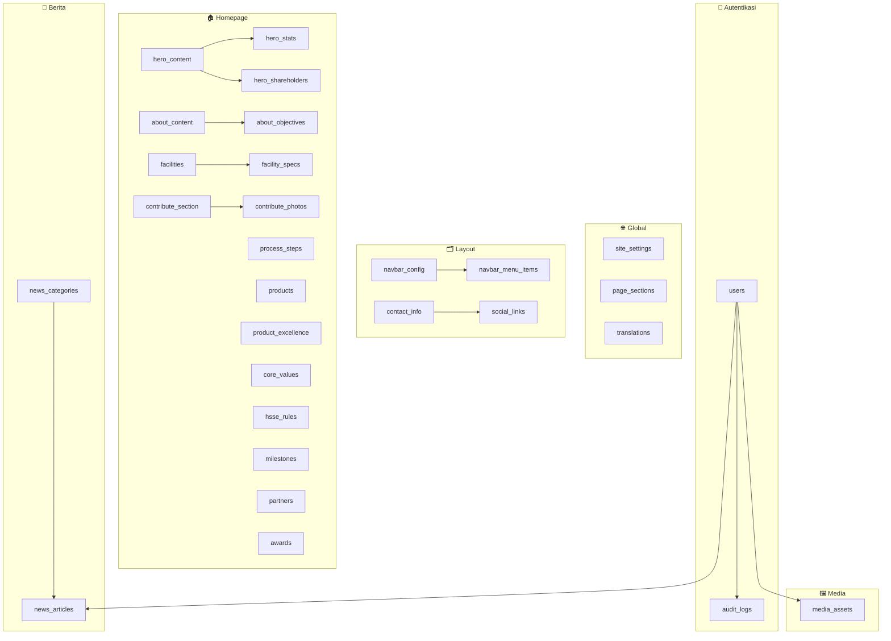

# Dokumentasi Database — PT Perta-Samtan Gas Company Profile & CMS

> **Versi:** 2.0 — diperbarui Mei 2026  
> Dokumen ini mencakup skema database, panduan CMS responsiveness, sistem i18n, dan API yang direkomendasikan untuk migrasi dari localStorage ke backend produksi.

---

## Daftar Isi

1. [Ringkasan Arsitektur](#1-ringkasan-arsitektur)
2. [Diagram ERD](#2-diagram-erd)
3. [Definisi Tabel Lengkap](#3-definisi-tabel-lengkap)
4. [Sistem i18n (Bahasa)](#4-sistem-i18n-bahasa)
5. [Panduan CMS Responsiveness](#5-panduan-cms-responsiveness)
6. [Mapping CMS → Database](#6-mapping-cms--database)
7. [Contoh Query SQL](#7-contoh-query-sql)
8. [Rekomendasi API](#8-rekomendasi-api)
9. [Catatan Implementasi & Migrasi](#9-catatan-implementasi--migrasi)

---

## 1. Ringkasan Arsitektur

| Aspek | Saat Ini (Dev) | Target (Produksi) |
|-------|---------------|-------------------|
| **Storage** | `localStorage` (`psg_content_v1`) | PostgreSQL / MySQL |
| **Auth** | Hardcoded `admin/admin123` di `AuthContext` | Tabel `users` + JWT |
| **i18n** | File statis `src/i18n/translations.js` | Tabel `translations` di DB |
| **Media** | File statis di `/public` | Tabel `media_assets` + object storage (S3/MinIO) |
| **Bahasa** | ID (default) & EN via `LanguageContext` + `localStorage` | Kolom `lang` di setiap tabel konten |
| **Draft** | Kolom `published` di array `news` | `is_published` + `published_at` di `news_articles` |

**Prinsip desain:**
- Data **singleton** (Hero, About, Navbar, Contact) → satu baris per tabel, `id = 1`
- Data **berulang** (produk, fasilitas, milestone, berita) → tabel terpisah dengan `sort_order`
- Konten **bilingual** → kolom `_id` / `_en` berpasangan, atau tabel `translations` (lihat §4)
- Spesifikasi bersarang → tabel anak one-to-many (bukan `spec1k`, `spec2k`, ...)

---

## 2. Diagram ERD

### 2.1 ERD Utama (Mermaid)

```mermaid
erDiagram
    users ||--o{ audit_logs : "membuat"
    users ||--o{ news_articles : "menulis"
    users ||--o{ media_assets : "upload"

    site_settings ||--|| hero_content : "1:1"
    site_settings ||--|| navbar_config : "1:1"
    site_settings ||--|| about_content : "1:1"
    site_settings ||--|| contact_info : "1:1"

    hero_content ||--o{ hero_stats : "memiliki"
    hero_content ||--o{ hero_shareholders : "memiliki"

    navbar_config ||--o{ navbar_menu_items : "memiliki"
    navbar_menu_items ||--o{ navbar_menu_items : "parent_id (sub-menu)"

    about_content ||--o{ about_objectives : "memiliki"

    facilities ||--o{ facility_specs : "memiliki"

    news_categories ||--o{ news_articles : "mengelompokkan"

    contact_info ||--o{ social_links : "memiliki"

    contribute_section ||--o{ contribute_photos : "memiliki"

    translations }o--|| site_settings : "bahasa konten"

    users {
        bigint id PK
        varchar username UK
        varchar email UK
        varchar password_hash
        enum role
        boolean is_active
        timestamp last_login_at
        timestamp created_at
        timestamp updated_at
    }

    site_settings {
        bigint id PK
        varchar site_name
        varchar site_tagline
        boolean show_scroll_to_top
        timestamp updated_at
    }

    page_sections {
        bigint id PK
        varchar section_key UK
        varchar label_id
        varchar label_en
        boolean is_visible
        int sort_order
    }

    hero_content {
        bigint id PK
        varchar eyebrow_id
        varchar eyebrow_en
        varchar headline_1_id
        varchar headline_1_en
        varchar headline_2_id
        varchar headline_2_en
        varchar headline_3_id
        varchar headline_3_en
        text description_id
        text description_en
        varchar btn_primary_label_id
        varchar btn_primary_label_en
        varchar btn_primary_link
        enum btn_primary_type
        varchar btn_secondary_label_id
        varchar btn_secondary_label_en
        varchar btn_secondary_link
        enum btn_secondary_type
        boolean btn_secondary_visible
        boolean show_shareholders
        timestamp updated_at
    }

    hero_stats {
        bigint id PK
        bigint hero_id FK
        decimal value
        varchar suffix_id
        varchar suffix_en
        varchar label_id
        varchar label_en
        int sort_order
    }

    hero_shareholders {
        bigint id PK
        bigint hero_id FK
        varchar name
        varchar percentage
        int sort_order
    }

    navbar_config {
        bigint id PK
        varchar brand_name
        varchar brand_sub
        varchar top_strip_id
        varchar top_strip_en
        boolean show_top_strip
        varchar cta_label_id
        varchar cta_label_en
        varchar cta_link
        timestamp updated_at
    }

    navbar_menu_items {
        bigint id PK
        bigint navbar_id FK
        bigint parent_id FK
        varchar label_id
        varchar label_en
        varchar link
        int sort_order
    }

    about_content {
        bigint id PK
        varchar heading
        text body_1_id
        text body_1_en
        text body_2_id
        text body_2_en
        text vision_id
        text vision_en
        text mission_id
        text mission_en
        varchar founded
        varchar capacity
        varchar plants
        varchar hq
        timestamp updated_at
    }

    about_objectives {
        bigint id PK
        bigint about_id FK
        text text_id
        text text_en
        int sort_order
    }

    process_steps {
        bigint id PK
        varchar step_no
        varchar title_id
        varchar title_en
        varchar sub_id
        varchar sub_en
        text description_id
        text description_en
        varchar output_id
        varchar output_en
        int sort_order
    }

    facilities {
        bigint id PK
        varchar title_id
        varchar title_en
        varchar label_id
        varchar label_en
        varchar location_id
        varchar location_en
        text description_id
        text description_en
        varchar image_url
        int sort_order
    }

    facility_specs {
        bigint id PK
        bigint facility_id FK
        varchar key_id
        varchar key_en
        varchar value
        int sort_order
    }

    products {
        bigint id PK
        varchar item_no
        varchar icon
        varchar title_id
        varchar title_en
        varchar subtitle_id
        varchar subtitle_en
        text description_id
        text description_en
        varchar stat_id
        varchar stat_en
        varchar color_class
        int sort_order
    }

    product_excellence {
        bigint id PK
        varchar title_id
        varchar title_en
        text description_id
        text description_en
        varchar icon
        int sort_order
    }

    core_values {
        bigint id PK
        varchar item_no
        varchar title_id
        varchar title_en
        text description_id
        text description_en
        varchar icon
        int sort_order
    }

    hsse_rules {
        bigint id PK
        varchar title_id
        varchar title_en
        text description_id
        text description_en
        int sort_order
    }

    milestones {
        bigint id PK
        varchar year_label
        varchar title_id
        varchar title_en
        text description_id
        text description_en
        boolean is_done
        varchar icon
        int sort_order
    }

    news_categories {
        bigint id PK
        varchar name_id UK
        varchar name_en UK
        varchar slug UK
    }

    news_articles {
        bigint id PK
        bigint category_id FK
        bigint author_user_id FK
        varchar title_id
        varchar title_en
        varchar slug UK
        text excerpt_id
        text excerpt_en
        longtext content_id
        longtext content_en
        varchar image_url
        varchar author_display
        varchar read_time_id
        varchar read_time_en
        boolean is_published
        timestamp published_at
        int sort_order
        timestamp created_at
        timestamp updated_at
    }

    partners {
        bigint id PK
        varchar name
        varchar logo_url
        int sort_order
    }

    awards {
        bigint id PK
        varchar title_id
        varchar title_en
        varchar organization_id
        varchar organization_en
        text description_id
        text description_en
        varchar icon
        int sort_order
    }

    contribute_section {
        bigint id PK
        varchar eyebrow_id
        varchar eyebrow_en
        varchar heading_id
        varchar heading_en
        text subtitle_id
        text subtitle_en
        timestamp updated_at
    }

    contribute_photos {
        bigint id PK
        bigint contribute_id FK
        varchar image_url
        varchar title_id
        varchar title_en
        text caption_id
        text caption_en
        int sort_order
    }

    contact_info {
        bigint id PK
        varchar phone_1
        varchar phone_1_sub
        varchar phone_2
        varchar phone_2_sub
        varchar website
        varchar address_line_1
        varchar address_line_2
        text liaison_address_id
        text liaison_address_en
        varchar liaison_label_id
        varchar liaison_label_en
        varchar copyright_text
        boolean show_liaison_strip
        timestamp updated_at
    }

    social_links {
        bigint id PK
        bigint contact_id FK
        enum platform
        varchar url
        int sort_order
    }

    translations {
        bigint id PK
        varchar lang
        varchar namespace
        varchar key_path
        text value
        timestamp updated_at
    }

    media_assets {
        bigint id PK
        bigint uploaded_by FK
        varchar file_path
        varchar original_name
        varchar mime_type
        int file_size_bytes
        varchar alt_text
        timestamp created_at
    }

    audit_logs {
        bigint id PK
        bigint user_id FK
        varchar action
        varchar entity_type
        bigint entity_id
        json changes_before
        json changes_after
        timestamp created_at
    }
```



### 2.2 Peta Modul



---

## 3. Definisi Tabel Lengkap

### 3.1 `users` — Admin CMS

| Kolom | Tipe | Constraint | Keterangan |
|-------|------|------------|------------|
| `id` | BIGINT | PK, AUTO_INCREMENT | |
| `username` | VARCHAR(50) | UNIQUE, NOT NULL | Login CMS |
| `email` | VARCHAR(255) | UNIQUE, NULL | Opsional |
| `password_hash` | VARCHAR(255) | NOT NULL | bcrypt / argon2 |
| `full_name` | VARCHAR(100) | NULL | Tampilan di CMS |
| `role` | ENUM | NOT NULL, DEFAULT `'editor'` | `super_admin`, `admin`, `editor` |
| `is_active` | BOOLEAN | DEFAULT TRUE | |
| `last_login_at` | TIMESTAMP | NULL | |
| `created_at` | TIMESTAMP | NOT NULL | |
| `updated_at` | TIMESTAMP | NOT NULL | |

**Mapping saat ini:** `AuthContext.jsx` (hardcoded `admin/admin123`) → harus hash bcrypt di DB.

---

### 3.2 `site_settings` — Pengaturan Global

| Kolom | Tipe | Constraint | Keterangan |
|-------|------|------------|------------|
| `id` | BIGINT | PK | Singleton: selalu `1` |
| `site_name` | VARCHAR(200) | NOT NULL | |
| `site_tagline` | VARCHAR(300) | NULL | |
| `show_scroll_to_top` | BOOLEAN | DEFAULT TRUE | |
| `updated_at` | TIMESTAMP | NOT NULL | |

---

### 3.3 `page_sections` — Visibilitas & Urutan Section

| Kolom | Tipe | Constraint | Keterangan |
|-------|------|------------|------------|
| `id` | BIGINT | PK | |
| `section_key` | VARCHAR(50) | UNIQUE, NOT NULL | `about`, `process`, `facilities`, `products`, `whyus`, `roadmap`, `contribute`, `news`, `clients` |
| `label_id` | VARCHAR(100) | NOT NULL | Label CMS (Bahasa Indonesia) |
| `label_en` | VARCHAR(100) | NOT NULL | Label CMS (Bahasa Inggris) |
| `is_visible` | BOOLEAN | DEFAULT TRUE | Kontrol tampil/sembunyi di homepage |
| `sort_order` | INT | DEFAULT 0 | Urutan section di halaman — **mendukung drag-and-drop di CMS** |

> **Catatan responsiveness:** Urutan `sort_order` juga menentukan urutan render di `HomePage.jsx`. Saat section disembunyikan (`is_visible = false`), section lain otomatis mengisi posisi tanpa gap karena menggunakan `flex-col` atau conditional rendering bersyarat.

**Data awal:**

| section_key | label_id | label_en | is_visible | sort_order |
|-------------|----------|----------|------------|------------|
| about | Tentang Perusahaan | About the Company | true | 1 |
| clients | Mitra & Penghargaan | Partners & Awards | true | 2 |
| process | Proses Bisnis | Business Process | true | 3 |
| facilities | Fasilitas | Facilities | true | 4 |
| products | Produk | Products | true | 5 |
| whyus | Nilai & HSSE | Values & HSSE | true | 6 |
| roadmap | Roadmap | Milestones | true | 7 |
| contribute | Kontribusi Kami | Our Contribution | true | 8 |
| news | Berita | News | false | 9 |

---

### 3.4 `hero_content` — Section Hero

| Kolom | Tipe | Constraint | Keterangan |
|-------|------|------------|------------|
| `id` | BIGINT | PK | Singleton: `1` |
| `eyebrow_id` / `eyebrow_en` | VARCHAR(200) | NULL | Teks kecil atas judul |
| `headline_1_id` / `_en` | VARCHAR(150) | NOT NULL | Baris pertama judul |
| `headline_2_id` / `_en` | VARCHAR(150) | NULL | Baris highlight (gradient) |
| `headline_3_id` / `_en` | VARCHAR(150) | NULL | Baris ketiga |
| `description_id` / `_en` | TEXT | NULL | Paragraf deskripsi |
| `btn_primary_label_id` / `_en` | VARCHAR(80) | NULL | |
| `btn_primary_link` | VARCHAR(500) | NULL | `#tentang`, URL, dll. |
| `btn_primary_type` | ENUM | DEFAULT `'scroll'` | `scroll`, `internal`, `external` |
| `btn_secondary_label_id` / `_en` | VARCHAR(80) | NULL | |
| `btn_secondary_link` | VARCHAR(500) | NULL | |
| `btn_secondary_type` | ENUM | DEFAULT `'scroll'` | |
| `btn_secondary_visible` | BOOLEAN | DEFAULT TRUE | |
| `show_shareholders` | BOOLEAN | DEFAULT TRUE | |
| `updated_at` | TIMESTAMP | NOT NULL | |

---

### 3.5 `hero_stats` — Statistik Angka di Hero

| Kolom | Tipe | Constraint | Keterangan |
|-------|------|------------|------------|
| `id` | BIGINT | PK | |
| `hero_id` | BIGINT | FK → `hero_content.id` | |
| `value` | DECIMAL(15,2) | NOT NULL | Angka count-up |
| `suffix_id` / `suffix_en` | VARCHAR(30) | NULL | ` MMSCFD`, ` MT/Hari` / ` MT/Day` |
| `label_id` / `label_en` | VARCHAR(100) | NOT NULL | |
| `sort_order` | INT | DEFAULT 0 | |

---

### 3.6 `hero_shareholders`

| Kolom | Tipe | Constraint |
|-------|------|------------|
| `id` | BIGINT | PK |
| `hero_id` | BIGINT | FK → `hero_content.id` |
| `name` | VARCHAR(150) | NOT NULL |
| `percentage` | VARCHAR(10) | NOT NULL |
| `sort_order` | INT | DEFAULT 0 |

---

### 3.7 `navbar_config`

| Kolom | Tipe | Keterangan |
|-------|------|------------|
| `id` | BIGINT PK | Singleton: `1` |
| `brand_name` | VARCHAR(100) | |
| `brand_sub` | VARCHAR(50) | `GAS` |
| `top_strip_id` / `top_strip_en` | VARCHAR(300) | Banner atas |
| `show_top_strip` | BOOLEAN | |
| `cta_label_id` / `cta_label_en` | VARCHAR(80) | |
| `cta_link` | VARCHAR(500) | |
| `updated_at` | TIMESTAMP | |

---

### 3.8 `navbar_menu_items`

| Kolom | Tipe | Keterangan |
|-------|------|------------|
| `id` | BIGINT PK | |
| `navbar_id` | BIGINT FK | → `navbar_config.id` |
| `parent_id` | BIGINT FK NULL | Self-reference untuk dropdown |
| `label_id` / `label_en` | VARCHAR(80) | NOT NULL |
| `link` | VARCHAR(500) | `#beranda`, `/berita`, URL |
| `sort_order` | INT | DEFAULT 0 |

**Data awal (EN / ID):**

| label_id | label_en | link | sort_order |
|----------|----------|------|------------|
| Beranda | Home | #beranda | 1 |
| Tentang Perusahaan | About the Company | #tentang | 2 |
| Proses | Process | #proses | 3 |
| Fasilitas | Facilities | #fasilitas | 4 |
| Produk | Products | #produk | 5 |
| Kontribusi | Our Contribution | #contribute | 6 |

---

### 3.9 `about_content`

| Kolom | Tipe | Keterangan |
|-------|------|------------|
| `id` | BIGINT PK | Singleton: `1` |
| `heading` | VARCHAR(200) | Nama perusahaan (sama di semua bahasa) |
| `body_1_id` / `body_1_en` | TEXT | Paragraf 1 |
| `body_2_id` / `body_2_en` | TEXT | Paragraf 2 |
| `vision_id` / `vision_en` | TEXT | |
| `mission_id` / `mission_en` | TEXT | |
| `facility_label_id` / `facility_label_en` | VARCHAR(150) | Caption foto |
| `updated_at` | TIMESTAMP | |

---

### 3.10 `about_objectives`

| Kolom | Tipe | Keterangan |
|-------|------|------------|
| `id` | BIGINT PK | |
| `about_id` | BIGINT FK | → `about_content.id` |
| `text_id` | TEXT NOT NULL | |
| `text_en` | TEXT NOT NULL | |
| `sort_order` | INT | DEFAULT 0 |

---

### 3.11 `process_steps`

| Kolom | Tipe | Keterangan |
|-------|------|------------|
| `id` | BIGINT PK | |
| `step_no` | VARCHAR(5) | `01`–`05` |
| `title_id` / `title_en` | VARCHAR(150) | Judul langkah |
| `sub_id` / `sub_en` | VARCHAR(100) | Sub-judul (nama kilang/fase) |
| `description_id` / `description_en` | TEXT | Deskripsi langkah |
| `output_id` / `output_en` | VARCHAR(80) | Badge output (mis. `710 MT/Hari`) |
| `sort_order` | INT | DEFAULT 0 |

> **Responsiveness:** Timeline desktop selalu menampilkan 5 langkah dengan layout zig-zag. Jika `sort_order` berubah atau ada langkah tambah/hapus, komponen `Process.jsx` akan merender ulang secara otomatis karena data di-map ke `STEP_VISUALS[]` berdasarkan indeks.

---

### 3.12 `facilities`

| Kolom | Tipe | Keterangan |
|-------|------|------------|
| `id` | BIGINT PK | |
| `title_id` / `title_en` | VARCHAR(200) | |
| `label_id` / `label_en` | VARCHAR(100) | Badge warna (Ex: "Extraction Plant") |
| `location_id` / `location_en` | VARCHAR(200) | |
| `description_id` / `description_en` | TEXT | |
| `image_url` | VARCHAR(500) | Path `/public/...` atau URL eksternal |
| `sort_order` | INT | DEFAULT 0 |

**Aturan Layout Responsif `Facilities.jsx`:**

| Jumlah item aktif | Layout yang dirender |
|-------------------|---------------------|
| 0 | Pesan kosong |
| 1 | 1 kartu besar, terpusat (`max-w-md mx-auto`) |
| 2 | 2 kartu besar berdampingan, terpusat (`max-w-3xl mx-auto`) |
| 3 | 3 kartu besar equal-width |
| **4** | **Editorial: 2 kartu besar (2/3) + 2 kartu kompak (1/3)** ← layout default |
| 5+ | Grid 2 kolom, wrap alami |

---

### 3.13 `facility_specs`

| Kolom | Tipe | Keterangan |
|-------|------|------------|
| `id` | BIGINT PK | |
| `facility_id` | BIGINT FK | → `facilities.id`, ON DELETE CASCADE |
| `key_id` / `key_en` | VARCHAR(80) | Label spesifikasi |
| `value` | VARCHAR(100) | Nilai (angka/teknis, tidak perlu terjemahan) |
| `sort_order` | INT | DEFAULT 0 |

---

### 3.14 `products`

| Kolom | Tipe | Keterangan |
|-------|------|------------|
| `id` | BIGINT PK | |
| `item_no` | VARCHAR(5) | `01`, `02` |
| `icon` | VARCHAR(10) | Emoji |
| `title_id` / `title_en` | VARCHAR(150) | |
| `subtitle_id` / `subtitle_en` | VARCHAR(100) | |
| `description_id` / `description_en` | TEXT | |
| `stat_id` / `stat_en` | VARCHAR(50) | Badge angka highlight |
| `color_class` | VARCHAR(30) | `psg-red`, `psg-blue` |
| `sort_order` | INT | DEFAULT 0 |

**Aturan Layout Responsif `Products.jsx`:**

| Jumlah item | Grid yang diterapkan |
|-------------|---------------------|
| 1 | 1 kolom, terpusat `max-w-md mx-auto` |
| 2 | 2 kolom, terpusat `max-w-3xl mx-auto` ← default |
| 3 | 3 kolom equal-width |
| 4+ | 4 kolom (atau 2-col di layar kecil) |

---

### 3.15 `product_excellence`

| Kolom | Tipe | Keterangan |
|-------|------|------------|
| `id` | BIGINT PK | |
| `title_id` / `title_en` | VARCHAR(150) | |
| `description_id` / `description_en` | TEXT | |
| `icon` | VARCHAR(10) | Emoji |
| `sort_order` | INT | DEFAULT 0 |

---

### 3.16 `core_values` — Tata Nilai (Why Us)

| Kolom | Tipe | Keterangan |
|-------|------|------------|
| `id` | BIGINT PK | |
| `item_no` | VARCHAR(5) | `01`–`06` |
| `title_id` / `title_en` | VARCHAR(100) | |
| `description_id` / `description_en` | TEXT | |
| `icon` | VARCHAR(10) | Emoji |
| `sort_order` | INT | DEFAULT 0 |

**Aturan Layout Responsif `WhyUs.jsx` (Values Grid):**

| Jumlah item | Grid yang diterapkan |
|-------------|---------------------|
| 1 | 1 kartu, terpusat `max-w-sm mx-auto` |
| 2 | 2 kolom, terpusat `max-w-2xl mx-auto` |
| 3–4 | 2 kolom, terpusat `max-w-3xl mx-auto` |
| 5+ | 3 kolom `lg:grid-cols-3` ← default (6 item) |

---

### 3.17 `hsse_rules` — HSSE Golden Rules

| Kolom | Tipe | Keterangan |
|-------|------|------------|
| `id` | BIGINT PK | |
| `title_id` / `title_en` | VARCHAR(150) | |
| `description_id` / `description_en` | TEXT | |
| `sort_order` | INT | DEFAULT 0 |

---

### 3.18 `milestones` — Roadmap / Pencapaian

| Kolom | Tipe | Keterangan |
|-------|------|------------|
| `id` | BIGINT PK | |
| `year_label` | VARCHAR(20) | `2008`, `2026+`, `—` |
| `title_id` / `title_en` | VARCHAR(200) | |
| `description_id` / `description_en` | TEXT | |
| `is_done` | BOOLEAN | DEFAULT TRUE |
| `icon` | VARCHAR(10) | Emoji |
| `sort_order` | INT | DEFAULT 0 |

---

### 3.19 `contribute_section` — Our Contribution (header)

| Kolom | Tipe | Keterangan |
|-------|------|------------|
| `id` | BIGINT PK | Singleton: `1` |
| `eyebrow_id` / `eyebrow_en` | VARCHAR(100) | |
| `heading_id` / `heading_en` | VARCHAR(150) | |
| `subtitle_id` / `subtitle_en` | TEXT | |
| `gallery_label_id` / `gallery_label_en` | VARCHAR(80) | |
| `updated_at` | TIMESTAMP | |

---

### 3.20 `contribute_photos` — Foto CSR / Kontribusi

| Kolom | Tipe | Keterangan |
|-------|------|------------|
| `id` | BIGINT PK | |
| `contribute_id` | BIGINT FK | → `contribute_section.id` |
| `image_url` | VARCHAR(500) | Path file atau URL |
| `title_id` / `title_en` | VARCHAR(200) | Judul foto |
| `caption_id` / `caption_en` | TEXT | Keterangan foto |
| `sort_order` | INT | DEFAULT 0 |

---

### 3.21 `news_categories`

| Kolom | Tipe | Keterangan |
|-------|------|------------|
| `id` | BIGINT PK | |
| `name_id` | VARCHAR(50) UNIQUE | `Korporat`, `Operasional`, `HSSE`, `CSR` |
| `name_en` | VARCHAR(50) UNIQUE | `Corporate`, `Operational`, `HSSE`, `CSR` |
| `slug` | VARCHAR(50) UNIQUE | `korporat`, `operasional`, `hsse`, `csr` |

---

### 3.22 `news_articles`

| Kolom | Tipe | Keterangan |
|-------|------|------------|
| `id` | BIGINT PK | |
| `category_id` | BIGINT FK | → `news_categories.id` |
| `author_user_id` | BIGINT FK NULL | → `users.id` |
| `title_id` / `title_en` | VARCHAR(300) | |
| `slug` | VARCHAR(300) UNIQUE | URL: `/berita/{slug}` |
| `excerpt_id` / `excerpt_en` | TEXT | Ringkasan |
| `content_id` / `content_en` | LONGTEXT | Isi lengkap |
| `image_url` | VARCHAR(500) | |
| `author_display` | VARCHAR(100) | Nama tampilan publik |
| `read_time_id` / `read_time_en` | VARCHAR(20) | `3 menit` / `3 min read` |
| `is_published` | BOOLEAN | DEFAULT FALSE |
| `published_at` | TIMESTAMP NULL | |
| `sort_order` | INT | DEFAULT 0 |
| `created_at` | TIMESTAMP | |
| `updated_at` | TIMESTAMP | |

**Index disarankan:**
```sql
INDEX idx_published (is_published, sort_order DESC)
INDEX idx_category (category_id)
FULLTEXT idx_search (title_id, title_en, excerpt_id, excerpt_en)
```

---

### 3.23 `partners`

| Kolom | Tipe | Keterangan |
|-------|------|------------|
| `id` | BIGINT PK | |
| `name` | VARCHAR(150) NOT NULL | Nama resmi (tidak diterjemahkan) |
| `logo_url` | VARCHAR(500) | Path ke logo `/partners/...` |
| `sort_order` | INT | DEFAULT 0 |

---

### 3.24 `awards`

| Kolom | Tipe | Keterangan |
|-------|------|------------|
| `id` | BIGINT PK | |
| `title_id` / `title_en` | VARCHAR(150) | |
| `organization_id` / `organization_en` | VARCHAR(150) | |
| `description_id` / `description_en` | TEXT | |
| `icon` | VARCHAR(10) | |
| `image_url` | VARCHAR(500) | Foto piagam/plakat |
| `sort_order` | INT | DEFAULT 0 |

---

### 3.25 `contact_info`

| Kolom | Tipe | Keterangan |
|-------|------|------------|
| `id` | BIGINT PK | Singleton: `1` |
| `phone_1` / `phone_1_sub` | VARCHAR(80) | |
| `phone_2` / `phone_2_sub` | VARCHAR(80) | |
| `website` | VARCHAR(200) | |
| `address_line_1` / `address_line_2` | VARCHAR(200) | |
| `liaison_address_id` / `liaison_address_en` | TEXT | Kantor perwakilan |
| `liaison_label_id` / `liaison_label_en` | VARCHAR(100) | |
| `copyright_text` | VARCHAR(300) | |
| `show_liaison_strip` | BOOLEAN | DEFAULT TRUE |
| `updated_at` | TIMESTAMP | |

---

### 3.26 `social_links`

| Kolom | Tipe | Keterangan |
|-------|------|------------|
| `id` | BIGINT PK | |
| `contact_id` | BIGINT FK | → `contact_info.id` |
| `platform` | ENUM | `facebook`, `instagram`, `linkedin`, `youtube`, `x` |
| `url` | VARCHAR(500) NULL | Kosong = ikon disembunyikan |
| `sort_order` | INT | DEFAULT 0 |

---

### 3.27 `translations` — i18n Key-Value Store

Digunakan untuk UI strings yang tidak termasuk dalam konten CMS (label tombol, eyebrow, placeholder, error messages, dsb.).

| Kolom | Tipe | Keterangan |
|-------|------|------------|
| `id` | BIGINT PK | |
| `lang` | VARCHAR(5) NOT NULL | `id`, `en` |
| `namespace` | VARCHAR(50) NOT NULL | `nav`, `hero`, `about`, `footer`, ... |
| `key_path` | VARCHAR(200) NOT NULL | `contact`, `menuItems.0.label`, `stats.0.label` |
| `value` | TEXT NOT NULL | Teks terjemahan |
| `updated_at` | TIMESTAMP | |

**UNIQUE KEY:** `(lang, namespace, key_path)`

> **Alternatif lebih sederhana:** Simpan seluruh file `translations.js` per bahasa sebagai satu JSON blob di tabel `site_translations`:
>
> ```sql
> CREATE TABLE site_translations (
>   lang VARCHAR(5) PRIMARY KEY,
>   data JSON NOT NULL,
>   updated_at TIMESTAMP
> );
> ```
> Frontend fetch `GET /api/v1/translations/:lang` → replace `translations.js`.

---

### 3.28 `media_assets`

| Kolom | Tipe | Keterangan |
|-------|------|------------|
| `id` | BIGINT PK | |
| `uploaded_by` | BIGINT FK NULL | → `users.id` |
| `file_path` | VARCHAR(500) NOT NULL | `/uploads/...` |
| `original_name` | VARCHAR(255) | |
| `mime_type` | VARCHAR(100) | `image/jpeg`, `image/png` |
| `file_size_bytes` | INT | |
| `alt_text` | VARCHAR(255) | |
| `created_at` | TIMESTAMP | |

---

### 3.29 `audit_logs`

| Kolom | Tipe | Keterangan |
|-------|------|------------|
| `id` | BIGINT PK | |
| `user_id` | BIGINT FK NULL | → `users.id` |
| `action` | VARCHAR(50) | `create`, `update`, `delete`, `publish`, `toggle_section` |
| `entity_type` | VARCHAR(50) | `facilities`, `products`, `page_sections`, ... |
| `entity_id` | BIGINT NULL | |
| `changes_before` | JSON NULL | Snapshot sebelum |
| `changes_after` | JSON NULL | Snapshot sesudah |
| `created_at` | TIMESTAMP | |

---

## 4. Sistem i18n (Bahasa)

### 4.1 Arsitektur Saat Ini

```
src/
├── i18n/
│   └── translations.js          ← semua UI strings (ID + EN)
├── context/
│   └── LanguageContext.jsx      ← lang state, setLang(), t()
└── components/
    └── Navbar.jsx               ← tombol switch 🇮🇩 IND | 🇬🇧 ENG
```

**Alur:**
1. User klik tombol bahasa → `setLang('en')` dipanggil
2. `LanguageContext` simpan ke `localStorage('psg_lang')`
3. Semua komponen yang memanggil `useLanguage()` re-render otomatis
4. `t('section.key')` → lookup di `translations[lang][section][key]`

### 4.2 Namespace & Key yang Ada

| Namespace | Konten |
|-----------|--------|
| `nav` | Menu items, CTA, top strip, brand |
| `hero` | Headline, description, buttons, stat labels |
| `about` | Eyebrow, body, vision, mission, objectives, labels |
| `clients` | Partner aria, awards carousel, section headings |
| `process` | Eyebrow, heading, 5 steps, stats panel |
| `facilities` | Eyebrow, heading, 4 facility cards + specs |
| `products` | Eyebrow, heading, 2 products, excellence items |
| `whyus` | Eyebrow, heading, 6 values, 3 HSSE golden rules |
| `roadmap` | Eyebrow, heading, 6 milestones, CTA block |
| `contribute` | Eyebrow, heading, 5 CSR photos (title + caption) |
| `news` | Eyebrow, heading, UI labels |
| `footer` | Description, sections, nav links, legal |

### 4.3 Aturan Penambahan Terjemahan Baru

Saat menambahkan section atau field baru ke komponen:

1. Tambah key di `translations.id.{namespace}` (Bahasa Indonesia)
2. Tambah key yang **sama** di `translations.en.{namespace}` (English)
3. Gunakan `const xT = t('namespace')` di komponen, lalu akses `xT.key`
4. **Jangan** pakai `content.*` (CMS localStorage) untuk teks statis — gunakan `t()` saja
5. Data dinamis (gambar, URL, angka teknis) tetap di `content.*` atau DB

---

## 5. Panduan CMS Responsiveness

### 5.1 Prinsip Umum

Semua grid/layout di komponen homepage **sudah dihitung berdasarkan jumlah item aktif**, bukan jumlah hardcoded. Ini berarti:

- Menghapus 1 dari 4 fasilitas → layout otomatis berubah ke mode "3 kartu equal"
- Menghapus 1 dari 2 produk → kartu sisa otomatis terpusat di tengah
- Menghide seluruh section → section tersebut tidak meninggalkan ruang kosong

### 5.2 Tabel Aturan Per Komponen

| Komponen | File | Jumlah Item | Perilaku Layout |
|----------|------|-------------|-----------------|
| `Products` | `Products.jsx` | 1 | 1 kartu, `max-w-md mx-auto` |
| | | 2 | 2 kolom, `max-w-3xl mx-auto` |
| | | 3 | 3 kolom equal |
| | | 4+ | 4 kolom (sm: 2 kolom) |
| `Facilities` | `Facilities.jsx` | 1 | 1 kartu besar, terpusat |
| | | 2 | 2 kartu besar berdampingan |
| | | 3 | 3 kartu equal |
| | | **4** | **Editorial: 2 besar + 2 kompak (layout khas)** |
| | | 5+ | 2-kolom grid |
| `WhyUs Values` | `WhyUs.jsx` | 1 | 1 kartu, `max-w-sm mx-auto` |
| | | 2 | 2 kolom, `max-w-2xl mx-auto` |
| | | 3–4 | 2 kolom, `max-w-3xl mx-auto` |
| | | 5+ | 3 kolom (layout default 6 item) |
| `Excellence` | `Products.jsx` | 1 | Full width |
| | | 2 | 2 kolom (default) |
| | | 3+ | 3 kolom |
| `Roadmap` | `Roadmap.jsx` | Bebas | Timeline vertikal, wrap otomatis |
| `Contribute` | `Contribute.jsx` | Bebas | Carousel + thumbnail grid, adaptif |
| `Clients/Awards` | `Clients.jsx` | Bebas | Arc carousel, adaptif |

### 5.3 Visibilitas Section

Section di `page_sections` yang `is_visible = false` **tidak dirender sama sekali** di `HomePage.jsx`:

```jsx
// HomePage.jsx
{sec.facilities?.visible !== false && <Facilities />}
```

Karena menggunakan `flex-col` (bukan grid tetap di level halaman), section lain langsung mengisi posisi tanpa celah.

### 5.4 Cara Menambah Section Baru ke CMS

1. Buat komponen `src/components/MySectionName.jsx`
2. Tambah `section_key` baru di `page_sections` (DB) atau `defaultContent.sections` (localStorage)
3. Tambah ke `HomePage.jsx`: `{sec.mySection?.visible !== false && <MySectionName />}`
4. Tambah namespace baru di `translations.js` (ID + EN)
5. Tambah editor CMS di `src/cms/editors/EditMySection.jsx`
6. Daftarkan editor di `AdminLayout.jsx` / `App.jsx` route

---

## 6. Mapping CMS → Database

| Halaman CMS | Key localStorage | Tabel Database Utama |
|-------------|-----------------|----------------------|
| Dashboard | — | Agregasi dari semua tabel |
| Pengaturan Global | `settings` | `site_settings` |
| Visibilitas Section | `sections` | `page_sections` |
| Navbar & Menu | `navbar` | `navbar_config`, `navbar_menu_items` |
| Hero / Cover | `hero`, `stats` | `hero_content`, `hero_stats`, `hero_shareholders` |
| Tentang Perusahaan | `about` | `about_content`, `about_objectives` |
| Proses Bisnis | `process` | `process_steps` |
| Fasilitas | `facilities` | `facilities`, `facility_specs` |
| Produk | `products` | `products`, `product_excellence` |
| Our Contribution | `contribute` | `contribute_section`, `contribute_photos` |
| Berita | `news` | `news_categories`, `news_articles` |
| Kontak & Footer | `contact` | `contact_info`, `social_links` |
| Terjemahan UI | `translations.js` (statis) | `site_translations` (JSON blob) atau `translations` (key-value) |
| *(belum CMS)* | — | `core_values`, `hsse_rules`, `milestones`, `partners`, `awards` |

---

## 7. Contoh Query SQL

### 7.1 Homepage — Fasilitas Aktif (untuk layout adaptif)

```sql
-- Frontend perlu tahu COUNT untuk memilih mode layout
SELECT
  f.id,
  f.title_id, f.title_en,
  f.label_id, f.label_en,
  f.location_id, f.location_en,
  f.description_id, f.description_en,
  f.image_url,
  f.sort_order,
  -- Specs sebagai JSON array
  JSON_ARRAYAGG(
    JSON_OBJECT('key_id', fs.key_id, 'key_en', fs.key_en, 'value', fs.value)
    ORDER BY fs.sort_order
  ) AS specs
FROM facilities f
LEFT JOIN facility_specs fs ON fs.facility_id = f.id
GROUP BY f.id
ORDER BY f.sort_order ASC;
```

### 7.2 Visibilitas Section + Urutan

```sql
SELECT section_key, label_id, label_en, is_visible, sort_order
FROM page_sections
ORDER BY sort_order ASC;
```

### 7.3 Terjemahan UI per Bahasa

```sql
-- Opsi A: key-value
SELECT namespace, key_path, value
FROM translations
WHERE lang = 'en'
ORDER BY namespace, key_path;

-- Opsi B: JSON blob (lebih sederhana untuk frontend)
SELECT data FROM site_translations WHERE lang = 'en';
```

### 7.4 Berita — 5 Terbaru untuk Homepage

```sql
SELECT
  a.id,
  a.title_id, a.title_en,
  a.excerpt_id, a.excerpt_en,
  a.image_url,
  a.read_time_id, a.read_time_en,
  a.author_display,
  c.name_id AS cat_id, c.name_en AS cat_en,
  DATE_FORMAT(a.published_at, '%d %M %Y') AS date_formatted
FROM news_articles a
JOIN news_categories c ON c.id = a.category_id
WHERE a.is_published = TRUE
ORDER BY a.sort_order ASC, a.published_at DESC
LIMIT 5;
```

### 7.5 Produk Aktif (dengan jumlah untuk layout)

```sql
SELECT *, COUNT(*) OVER () AS total_count
FROM products
ORDER BY sort_order ASC;
-- Frontend: if total_count == 1 → center card
```

---

## 8. Rekomendasi API

### 8.1 Public Endpoints (tanpa auth)

| Method | Endpoint | Response | Cache |
|--------|----------|----------|-------|
| GET | `/api/v1/content` | Seluruh konten website (struktur mirip `defaultContent.js`) | 60 detik |
| GET | `/api/v1/translations/:lang` | JSON translations per bahasa | 5 menit |
| GET | `/api/v1/news` | Daftar berita (pagination, filter, search) | 30 detik |
| GET | `/api/v1/news/:id` | Detail satu artikel | 60 detik |

**Struktur `/api/v1/content` (sesuai struktur React saat ini):**

```json
{
  "settings": { ... },
  "sections": { "about": { "visible": true, "sort_order": 1 }, ... },
  "navbar": { "menuItems": [...], "topStrip": "...", ... },
  "hero": { ... },
  "stats": [...],
  "about": { ... },
  "process": [...],
  "facilities": [...],
  "products": [...],
  "contribute": { "photos": [...], ... },
  "contact": { ... }
}
```

### 8.2 Admin Endpoints (JWT required)

| Method | Endpoint | Deskripsi |
|--------|----------|-----------|
| POST | `/api/v1/auth/login` | Login → JWT token |
| POST | `/api/v1/auth/logout` | Invalidate token |
| GET/PUT | `/api/v1/admin/sections` | Toggle & reorder sections |
| GET/PUT | `/api/v1/admin/hero` | Edit hero + stats |
| GET/PUT | `/api/v1/admin/about` | Edit about + objectives |
| GET/PUT | `/api/v1/admin/process` | Edit process steps |
| GET/PUT | `/api/v1/admin/facilities` | Edit facilities + specs |
| GET/PUT | `/api/v1/admin/products` | Edit products + excellence |
| GET/PUT | `/api/v1/admin/contribute` | Edit CSR section + photos |
| CRUD | `/api/v1/admin/news` | List/create/update/delete/publish artikel |
| GET/PUT | `/api/v1/admin/translations/:lang` | Update terjemahan UI |
| POST | `/api/v1/admin/media/upload` | Upload gambar |

---

## 9. Catatan Implementasi & Migrasi

### 9.1 Langkah Migrasi dari localStorage

```
1. Export JSON dari browser:
   localStorage.getItem('psg_content_v1') → simpan sebagai seed.json

2. Buat script seed (Node.js / Python):
   parse seed.json → INSERT ke tabel-tabel sesuai §3

3. Ganti ContentContext:
   - loadContent()       → fetch GET /api/v1/content
   - updateSection()     → PUT  /api/v1/admin/{section}
   - resetSection()      → PUT  /api/v1/admin/{section} dengan defaultContent

4. Ganti LanguageContext:
   - translations import → fetch GET /api/v1/translations/:lang
   - cache di sessionStorage untuk performa

5. Ganti AuthContext:
   - hardcoded login  → POST /api/v1/auth/login → simpan JWT di httpOnly cookie
```

### 9.2 Urutan `sort_order`

- Nilai lebih **kecil** = tampil lebih **atas/kiri**
- Update saat drag-and-drop CMS: `PATCH /api/v1/admin/sections/reorder` dengan array urutan baru
- Berita homepage: 5 record `sort_order` terkecil + `is_published = TRUE`

### 9.3 Section yang Belum Memiliki Editor CMS

| Section | Tabel | Status |
|---------|-------|--------|
| Core Values / HSSE | `core_values`, `hsse_rules` | ❌ Belum ada editor |
| Milestones / Roadmap | `milestones` | ❌ Belum ada editor |
| Partners & Awards | `partners`, `awards` | ❌ Belum ada editor |
| Our Contribution | `contribute_section`, `contribute_photos` | ❌ Belum ada editor |

Prioritas pembuatan editor: **Our Contribution** (foto CSR sering berubah) → **Milestones** → **Core Values**.

### 9.4 Aturan Kunci Tabel

| Pattern | Tabel yang terdampak |
|---------|---------------------|
| Singleton (1 baris) | `site_settings`, `hero_content`, `navbar_config`, `about_content`, `contribute_section`, `contact_info` |
| Berulang + sort | Semua tabel lainnya |
| Self-reference | `navbar_menu_items.parent_id` |
| Cascade delete | `facility_specs`, `contribute_photos`, `about_objectives`, `hero_stats`, `hero_shareholders`, `social_links` |

### 9.5 Jumlah Tabel

| Kategori | Tabel | Jumlah |
|----------|-------|--------|
| Auth & audit | `users`, `audit_logs` | 2 |
| Global & i18n | `site_settings`, `page_sections`, `translations` / `site_translations` | 3 |
| Layout | `navbar_config`, `navbar_menu_items`, `contact_info`, `social_links` | 4 |
| Homepage content | `hero_content`, `hero_stats`, `hero_shareholders`, `about_content`, `about_objectives`, `process_steps`, `facilities`, `facility_specs`, `products`, `product_excellence`, `core_values`, `hsse_rules`, `milestones`, `partners`, `awards`, `contribute_section`, `contribute_photos` | 17 |
| Berita | `news_categories`, `news_articles` | 2 |
| Media | `media_assets` | 1 |
| **Total** | | **29 tabel** |

---

*Dokumen ini selaras dengan struktur proyek React + CMS per Mei 2026.*  
*Perbarui dokumen ini setiap kali menambah section, field, atau komponen baru ke website.*
