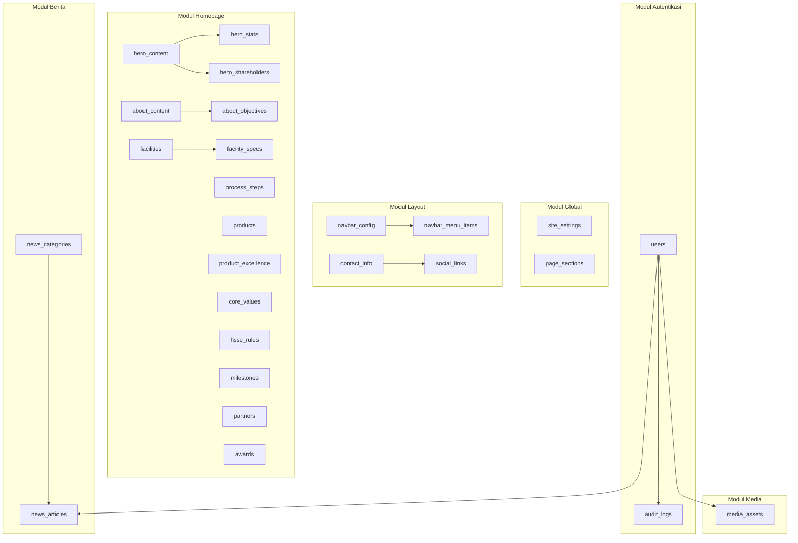

# Dokumentasi Database — PT Perta-Samtan Gas Company Profile & CMS

Dokumen ini menjelaskan skema database yang direkomendasikan untuk menggantikan penyimpanan **localStorage** saat ini, agar konten website dan CMS dapat dikelola melalui **backend API** (Node.js, Laravel, .NET, dll.) dengan data persisten dan aman.

---

## Daftar Isi

1. [Ringkasan Arsitektur](#1-ringkasan-arsitektur)
2. [Diagram ERD](#2-diagram-erd)
3. [Entitas & Relasi](#3-entitas--relasi)
4. [Definisi Tabel](#4-definisi-tabel)
5. [Mapping CMS → Database](#5-mapping-cms--database)
6. [Contoh Query](#6-contoh-query)
7. [Rekomendasi API](#7-rekomendasi-api)
8. [Catatan Implementasi](#8-catatan-implementasi)

---

## 1. Ringkasan Arsitektur

| Aspek | Keterangan |
|--------|------------|
| **Tipe DB** | Relasional (PostgreSQL / MySQL / MariaDB) |
| **Pola** | Satu website per instance; konten section-based + artikel berita |
| **Auth** | Tabel `users` + session/JWT; menggantikan hardcoded login di `AuthContext` |
| **Media** | URL string atau tabel `media_assets` untuk upload file ke storage (S3/local) |
| **Draft** | Kolom `is_published` / `published_at` pada `news_articles` |

**Prinsip normalisasi:**

- Data **singleton** (Hero, About, Navbar, Contact, Settings) → satu baris per tabel konfigurasi (`id = 1` atau `site_id`).
- Data **berulang** (statistik, menu, langkah proses, fasilitas, berita) → tabel terpisah dengan `sort_order`.
- Spesifikasi fasilitas & tujuan perusahaan → tabel anak (one-to-many), bukan kolom `spec1k`, `spec2k`, dll.

---

## 2. Diagram ERD

### 2.1 ERD Utama (Mermaid)

```mermaid
erDiagram
    users ||--o{ audit_logs : "membuat"
    users ||--o{ news_articles : "menulis"

    site_settings ||--|| hero_content : "1:1"
    site_settings ||--|| navbar_config : "1:1"
    site_settings ||--|| about_content : "1:1"
    site_settings ||--|| contact_info : "1:1"

    hero_content ||--o{ hero_stats : "memiliki"
    hero_content ||--o{ hero_shareholders : "memiliki"

    navbar_config ||--o{ navbar_menu_items : "memiliki"
    navbar_menu_items ||--o{ navbar_menu_items : "parent_id"

    about_content ||--o{ about_objectives : "memiliki"

    facilities ||--o{ facility_specs : "memiliki"

    news_categories ||--o{ news_articles : "mengelompokkan"

    page_sections }o--|| site_settings : "mengatur visibilitas"

    process_steps }o--|| site_settings : "konten"
    products }o--|| site_settings : "konten"
    product_excellence }o--|| site_settings : "konten"
    core_values }o--|| site_settings : "konten"
    hsse_rules }o--|| site_settings : "konten"
    milestones }o--|| site_settings : "konten"
    partners }o--|| site_settings : "konten"
    awards }o--|| site_settings : "konten"
    social_links }o--|| contact_info : "milik"

    users {
        bigint id PK
        varchar username UK
        varchar email UK
        varchar password_hash
        enum role
        boolean is_active
        timestamp last_login_at
        timestamp created_at
        timestamp updated_at
    }

    site_settings {
        bigint id PK
        varchar site_name
        varchar site_tagline
        boolean show_scroll_to_top
        timestamp updated_at
    }

    page_sections {
        bigint id PK
        varchar section_key UK
        varchar label
        boolean is_visible
        int sort_order
    }

    hero_content {
        bigint id PK
        varchar eyebrow
        varchar headline_1
        varchar headline_2
        varchar headline_3
        text description
        varchar btn_primary_label
        varchar btn_primary_link
        enum btn_primary_type
        varchar btn_secondary_label
        varchar btn_secondary_link
        enum btn_secondary_type
        boolean btn_secondary_visible
        boolean show_shareholders
    }

    hero_stats {
        bigint id PK
        bigint hero_id FK
        decimal value
        varchar suffix
        varchar label
        int sort_order
    }

    hero_shareholders {
        bigint id PK
        bigint hero_id FK
        varchar name
        varchar percentage
        int sort_order
    }

    navbar_config {
        bigint id PK
        varchar brand_name
        varchar brand_sub
        varchar top_strip
        boolean show_top_strip
        varchar cta_label
        varchar cta_link
    }

    navbar_menu_items {
        bigint id PK
        bigint navbar_id FK
        bigint parent_id FK
        varchar label
        varchar link
        int sort_order
    }

    about_content {
        bigint id PK
        varchar heading
        text body_1
        text body_2
        text vision
        text mission
        varchar founded
        varchar capacity
        varchar plants
        varchar hq
    }

    about_objectives {
        bigint id PK
        bigint about_id FK
        text objective_text
        int sort_order
    }

    process_steps {
        bigint id PK
        varchar step_no
        varchar icon
        varchar title
        text description
        varchar meta
        int sort_order
    }

    facilities {
        bigint id PK
        varchar title
        varchar label
        varchar location
        text description
        varchar image_url
        int sort_order
    }

    facility_specs {
        bigint id PK
        bigint facility_id FK
        varchar spec_key
        varchar spec_value
        int sort_order
    }

    products {
        bigint id PK
        varchar item_no
        varchar icon
        varchar title
        varchar subtitle
        text description
        varchar stat
        varchar color_class
        int sort_order
    }

    product_excellence {
        bigint id PK
        varchar title
        text description
        varchar icon
        int sort_order
    }

    core_values {
        bigint id PK
        varchar item_no
        varchar title
        text description
        varchar icon
        int sort_order
    }

    hsse_rules {
        bigint id PK
        varchar rule_text
        int sort_order
    }

    milestones {
        bigint id PK
        varchar year_label
        varchar title
        text description
        boolean is_done
        varchar icon
        int sort_order
    }

    news_categories {
        bigint id PK
        varchar name UK
        varchar slug UK
    }

    news_articles {
        bigint id PK
        bigint category_id FK
        bigint author_user_id FK
        varchar title
        varchar slug UK
        text excerpt
        longtext content
        varchar image_url
        varchar author_display
        varchar read_time
        boolean is_published
        timestamp published_at
        int sort_order
        timestamp created_at
        timestamp updated_at
    }

    partners {
        bigint id PK
        varchar name
        varchar abbr
        varchar color_class
        varchar border_class
        varchar bg_class
        int sort_order
    }

    awards {
        bigint id PK
        varchar title
        varchar organization
        text description
        varchar icon
        varchar accent_class
        int sort_order
    }

    contact_info {
        bigint id PK
        varchar phone_1
        varchar phone_1_sub
        varchar phone_2
        varchar phone_2_sub
        varchar website
        varchar address_line_1
        varchar address_line_2
        text liaison_address
        varchar copyright_text
        boolean show_liaison_strip
    }

    social_links {
        bigint id PK
        bigint contact_id FK
        enum platform
        varchar url
        int sort_order
    }

    media_assets {
        bigint id PK
        bigint uploaded_by FK
        varchar file_path
        varchar original_name
        varchar mime_type
        int file_size
        varchar alt_text
        timestamp created_at
    }

    audit_logs {
        bigint id PK
        bigint user_id FK
        varchar action
        varchar entity_type
        bigint entity_id
        json changes
        timestamp created_at
    }
```



### 2.2 ERD Ringkas (Grup Modul)



---

## 3. Entitas & Relasi

### 3.1 Tabel Relasi (Ringkasan)

| Relasi | Kardinalitas | Keterangan |
|--------|--------------|------------|
| `hero_content` → `hero_stats` | 1 : N | Statistik di bawah hero |
| `hero_content` → `hero_shareholders` | 1 : N | Badge pemegang saham |
| `navbar_config` → `navbar_menu_items` | 1 : N | Item menu; `parent_id` self-reference untuk dropdown |
| `navbar_menu_items` → `navbar_menu_items` | 1 : N | Sub-menu (opsional) |
| `about_content` → `about_objectives` | 1 : N | Daftar tujuan perusahaan |
| `facilities` → `facility_specs` | 1 : N | Spesifikasi per fasilitas (max 3+ baris) |
| `news_categories` → `news_articles` | 1 : N | Kategori berita |
| `users` → `news_articles` | 1 : N | Penulis (opsional, `author_user_id`) |
| `contact_info` → `social_links` | 1 : N | Link media sosial |
| `users` → `audit_logs` | 1 : N | Jejak perubahan CMS |

### 3.2 Tabel Tanpa FK (Konten Independen)

Tabel berikut tidak memerlukan foreign key ke entitas lain (diurutkan dengan `sort_order`):

- `page_sections`
- `process_steps`
- `products`
- `product_excellence`
- `core_values`
- `hsse_rules`
- `milestones`
- `partners`
- `awards`

> Jika nanti mendukung **multi-site**, tambahkan kolom `site_id` di semua tabel konten dan jadikan `site_settings` sebagai parent.

---

## 4. Definisi Tabel

### 4.1 `users` — Admin CMS

| Kolom | Tipe | Constraint | Keterangan |
|-------|------|------------|------------|
| `id` | BIGINT | PK, AUTO_INCREMENT | |
| `username` | VARCHAR(50) | UNIQUE, NOT NULL | Login CMS |
| `email` | VARCHAR(255) | UNIQUE, NULL | Opsional |
| `password_hash` | VARCHAR(255) | NOT NULL | bcrypt/argon2 |
| `full_name` | VARCHAR(100) | NULL | Tampilan di CMS |
| `role` | ENUM | NOT NULL, DEFAULT `'editor'` | `super_admin`, `admin`, `editor` |
| `is_active` | BOOLEAN | DEFAULT TRUE | Nonaktifkan akun |
| `last_login_at` | TIMESTAMP | NULL | |
| `created_at` | TIMESTAMP | NOT NULL | |
| `updated_at` | TIMESTAMP | NOT NULL | |

**Mapping saat ini:** `AuthContext.jsx` (`admin` / `admin123`) → harus disimpan sebagai hash di DB.

---

### 4.2 `site_settings` — Pengaturan Global

| Kolom | Tipe | Constraint | Keterangan |
|-------|------|------------|------------|
| `id` | BIGINT | PK | Singleton: selalu `1` |
| `site_name` | VARCHAR(200) | NOT NULL | |
| `site_tagline` | VARCHAR(300) | NULL | |
| `show_scroll_to_top` | BOOLEAN | DEFAULT TRUE | |
| `updated_at` | TIMESTAMP | NOT NULL | |

**Mapping CMS:** `/admin/settings` → `content.settings`

---

### 4.3 `page_sections` — Visibilitas Section Homepage

| Kolom | Tipe | Constraint | Keterangan |
|-------|------|------------|------------|
| `id` | BIGINT | PK | |
| `section_key` | VARCHAR(50) | UNIQUE, NOT NULL | `about`, `process`, `facilities`, `products`, `whyus`, `roadmap`, `news`, `clients` |
| `label` | VARCHAR(100) | NOT NULL | Label di CMS |
| `is_visible` | BOOLEAN | DEFAULT TRUE | |
| `sort_order` | INT | DEFAULT 0 | Urutan di dashboard |

**Mapping CMS:** `/admin/sections` → `content.sections`

---

### 4.4 `hero_content` — Section Hero / Cover

| Kolom | Tipe | Constraint | Keterangan |
|-------|------|------------|------------|
| `id` | BIGINT | PK | Singleton: `1` |
| `eyebrow` | VARCHAR(200) | NULL | |
| `headline_1` | VARCHAR(150) | NOT NULL | |
| `headline_2` | VARCHAR(150) | NULL | Baris highlight |
| `headline_3` | VARCHAR(150) | NULL | |
| `description` | TEXT | NULL | |
| `btn_primary_label` | VARCHAR(80) | NULL | |
| `btn_primary_link` | VARCHAR(500) | NULL | `#tentang`, `/berita`, URL |
| `btn_primary_type` | ENUM | DEFAULT `'scroll'` | `scroll`, `internal`, `external` |
| `btn_secondary_label` | VARCHAR(80) | NULL | |
| `btn_secondary_link` | VARCHAR(500) | NULL | |
| `btn_secondary_type` | ENUM | DEFAULT `'scroll'` | |
| `btn_secondary_visible` | BOOLEAN | DEFAULT TRUE | |
| `show_shareholders` | BOOLEAN | DEFAULT TRUE | |
| `updated_at` | TIMESTAMP | NOT NULL | |

**Mapping CMS:** `/admin/hero` → `content.hero`

---

### 4.5 `hero_stats` — Statistik Hero

| Kolom | Tipe | Constraint | Keterangan |
|-------|------|------------|------------|
| `id` | BIGINT | PK | |
| `hero_id` | BIGINT | FK → `hero_content.id`, NOT NULL | |
| `value` | DECIMAL(15,2) | NOT NULL | Angka animasi count-up |
| `suffix` | VARCHAR(30) | NULL | Contoh: ` MMSCFD`, `%` |
| `label` | VARCHAR(100) | NOT NULL | |
| `sort_order` | INT | DEFAULT 0 | |

**Mapping CMS:** `/admin/hero` → `content.stats[]`

---

### 4.6 `hero_shareholders` — Pemegang Saham (Hero)

| Kolom | Tipe | Constraint | Keterangan |
|-------|------|------------|------------|
| `id` | BIGINT | PK | |
| `hero_id` | BIGINT | FK → `hero_content.id`, NOT NULL | |
| `name` | VARCHAR(150) | NOT NULL | |
| `percentage` | VARCHAR(10) | NOT NULL | Contoh: `66%` |
| `sort_order` | INT | DEFAULT 0 | |

**Mapping saat ini:** `shareholder1Name`, `shareholder1Pct`, dll. di `content.hero`

---

### 4.7 `navbar_config` — Konfigurasi Navbar

| Kolom | Tipe | Constraint | Keterangan |
|-------|------|------------|------------|
| `id` | BIGINT | PK | Singleton: `1` |
| `brand_name` | VARCHAR(100) | NOT NULL | |
| `brand_sub` | VARCHAR(50) | NULL | Contoh: `GAS` |
| `top_strip` | VARCHAR(300) | NULL | Teks banner atas |
| `show_top_strip` | BOOLEAN | DEFAULT TRUE | |
| `cta_label` | VARCHAR(80) | NULL | |
| `cta_link` | VARCHAR(500) | NULL | |
| `updated_at` | TIMESTAMP | NOT NULL | |

**Mapping CMS:** `/admin/navbar` → `content.navbar` (tanpa `menuItems`)

---

### 4.8 `navbar_menu_items` — Item Menu Navigasi

| Kolom | Tipe | Constraint | Keterangan |
|-------|------|------------|------------|
| `id` | BIGINT | PK | |
| `navbar_id` | BIGINT | FK → `navbar_config.id`, NOT NULL | |
| `parent_id` | BIGINT | FK → `navbar_menu_items.id`, NULL | Sub-menu |
| `label` | VARCHAR(80) | NOT NULL | |
| `link` | VARCHAR(500) | NOT NULL | `#beranda`, `/berita`, URL |
| `sort_order` | INT | DEFAULT 0 | |

**Mapping CMS:** `content.navbar.menuItems[]`

---

### 4.9 `about_content` — Tentang Perusahaan

| Kolom | Tipe | Constraint | Keterangan |
|-------|------|------------|------------|
| `id` | BIGINT | PK | Singleton: `1` |
| `heading` | VARCHAR(200) | NOT NULL | |
| `body_1` | TEXT | NULL | |
| `body_2` | TEXT | NULL | |
| `vision` | TEXT | NULL | |
| `mission` | TEXT | NULL | |
| `founded` | VARCHAR(50) | NULL | |
| `capacity` | VARCHAR(50) | NULL | |
| `plants` | VARCHAR(50) | NULL | |
| `hq` | VARCHAR(100) | NULL | |
| `updated_at` | TIMESTAMP | NOT NULL | |

**Mapping CMS:** `/admin/about` → `content.about` (tanpa `objectives`)

---

### 4.10 `about_objectives` — Tujuan Perusahaan

| Kolom | Tipe | Constraint | Keterangan |
|-------|------|------------|------------|
| `id` | BIGINT | PK | |
| `about_id` | BIGINT | FK → `about_content.id`, NOT NULL | |
| `objective_text` | TEXT | NOT NULL | |
| `sort_order` | INT | DEFAULT 0 | |

**Mapping CMS:** `content.about.objectives[]`

---

### 4.11 `process_steps` — Proses Bisnis

| Kolom | Tipe | Constraint | Keterangan |
|-------|------|------------|------------|
| `id` | BIGINT | PK | |
| `step_no` | VARCHAR(5) | NOT NULL | `01`, `02`, ... |
| `icon` | VARCHAR(10) | NULL | Emoji atau class icon |
| `title` | VARCHAR(150) | NOT NULL | |
| `description` | TEXT | NULL | |
| `meta` | VARCHAR(100) | NULL | Badge kecil |
| `sort_order` | INT | DEFAULT 0 | |

**Mapping CMS:** `/admin/process` → `content.process[]`

---

### 4.12 `facilities` — Fasilitas Operasional

| Kolom | Tipe | Constraint | Keterangan |
|-------|------|------------|------------|
| `id` | BIGINT | PK | |
| `title` | VARCHAR(200) | NOT NULL | |
| `label` | VARCHAR(100) | NULL | Sub-label |
| `location` | VARCHAR(200) | NULL | |
| `description` | TEXT | NULL | |
| `image_url` | VARCHAR(500) | NULL | Path `/public/...` atau URL |
| `sort_order` | INT | DEFAULT 0 | |

**Mapping CMS:** `/admin/facilities` → `content.facilities[]`

---

### 4.13 `facility_specs` — Spesifikasi Fasilitas

| Kolom | Tipe | Constraint | Keterangan |
|-------|------|------------|------------|
| `id` | BIGINT | PK | |
| `facility_id` | BIGINT | FK → `facilities.id`, ON DELETE CASCADE | |
| `spec_key` | VARCHAR(80) | NOT NULL | Label |
| `spec_value` | VARCHAR(100) | NOT NULL | Nilai |
| `sort_order` | INT | DEFAULT 0 | |

**Mapping saat ini:** `spec1k/spec1v`, `spec2k/spec2v`, `spec3k/spec3v` → 3 baris per fasilitas

---

### 4.14 `products` — Produk

| Kolom | Tipe | Constraint | Keterangan |
|-------|------|------------|------------|
| `id` | BIGINT | PK | |
| `item_no` | VARCHAR(5) | NULL | `01`, `02` |
| `icon` | VARCHAR(10) | NULL | |
| `title` | VARCHAR(150) | NOT NULL | |
| `subtitle` | VARCHAR(100) | NULL | |
| `description` | TEXT | NULL | |
| `stat` | VARCHAR(50) | NULL | Angka highlight |
| `color_class` | VARCHAR(30) | NULL | `psg-red`, `psg-blue` |
| `sort_order` | INT | DEFAULT 0 | |

**Mapping CMS:** `/admin/products` → `content.products[]`

---

### 4.15 `product_excellence` — Keunggulan Perseroan

| Kolom | Tipe | Constraint | Keterangan |
|-------|------|------------|------------|
| `id` | BIGINT | PK | |
| `title` | VARCHAR(150) | NOT NULL | |
| `description` | TEXT | NULL | |
| `icon` | VARCHAR(10) | NULL | |
| `sort_order` | INT | DEFAULT 0 | |

**Mapping saat ini:** Hardcoded `EXCELLENCE` di `Products.jsx` — belum di CMS, perlu editor baru.

---

### 4.16 `core_values` — Nilai Perusahaan (Why Us)

| Kolom | Tipe | Constraint | Keterangan |
|-------|------|------------|------------|
| `id` | BIGINT | PK | |
| `item_no` | VARCHAR(5) | NULL | |
| `title` | VARCHAR(100) | NOT NULL | |
| `description` | TEXT | NULL | |
| `icon` | VARCHAR(10) | NULL | |
| `sort_order` | INT | DEFAULT 0 | |

**Mapping saat ini:** Hardcoded `VALUES` di `WhyUs.jsx` — belum di CMS.

---

### 4.17 `hsse_rules` — Aturan HSSE

| Kolom | Tipe | Constraint | Keterangan |
|-------|------|------------|------------|
| `id` | BIGINT | PK | |
| `rule_text` | VARCHAR(150) | NOT NULL | |
| `sort_order` | INT | DEFAULT 0 | |

**Mapping saat ini:** Hardcoded `RULES` di `WhyUs.jsx`.

---

### 4.18 `milestones` — Roadmap / Pencapaian

| Kolom | Tipe | Constraint | Keterangan |
|-------|------|------------|------------|
| `id` | BIGINT | PK | |
| `year_label` | VARCHAR(20) | NULL | `2008`, `2026+`, `—` |
| `title` | VARCHAR(200) | NOT NULL | |
| `description` | TEXT | NULL | |
| `is_done` | BOOLEAN | DEFAULT TRUE | |
| `icon` | VARCHAR(10) | NULL | |
| `sort_order` | INT | DEFAULT 0 | |

**Mapping saat ini:** Hardcoded `MILESTONES` di `Roadmap.jsx` — belum di CMS.

---

### 4.19 `news_categories` — Kategori Berita

| Kolom | Tipe | Constraint | Keterangan |
|-------|------|------------|------------|
| `id` | BIGINT | PK | |
| `name` | VARCHAR(50) | UNIQUE, NOT NULL | Korporat, Operasional, HSSE, CSR |
| `slug` | VARCHAR(50) | UNIQUE, NOT NULL | `korporat`, `operasional` |

**Data awal:**

| name | slug |
|------|------|
| Korporat | korporat |
| Operasional | operasional |
| HSSE | hsse |
| CSR | csr |

---

### 4.20 `news_articles` — Artikel Berita

| Kolom | Tipe | Constraint | Keterangan |
|-------|------|------------|------------|
| `id` | BIGINT | PK | |
| `category_id` | BIGINT | FK → `news_categories.id`, NOT NULL | |
| `author_user_id` | BIGINT | FK → `users.id`, NULL | Admin yang publish |
| `title` | VARCHAR(300) | NOT NULL | |
| `slug` | VARCHAR(300) | UNIQUE, NOT NULL | URL: `/berita/{slug}` atau `/berita/{id}` |
| `excerpt` | TEXT | NULL | Ringkasan |
| `content` | LONGTEXT | NULL | Isi lengkap (paragraf `\n\n`) |
| `image_url` | VARCHAR(500) | NULL | Thumbnail & hero detail |
| `author_display` | VARCHAR(100) | NULL | Tampilan publik |
| `read_time` | VARCHAR(20) | NULL | `3 menit` |
| `is_published` | BOOLEAN | DEFAULT FALSE | Draft vs publish |
| `published_at` | TIMESTAMP | NULL | Waktu publish |
| `sort_order` | INT | DEFAULT 0 | Urutan di homepage (5 teratas) |
| `created_at` | TIMESTAMP | NOT NULL | |
| `updated_at` | TIMESTAMP | NOT NULL | |

**Index disarankan:**

- `INDEX (is_published, sort_order DESC)`
- `INDEX (category_id)`
- `FULLTEXT (title, excerpt, content)` — untuk search di `/berita`

**Mapping CMS:** `/admin/news` → `content.news[]`

| Field lama (localStorage) | Kolom DB |
|---------------------------|----------|
| `published` | `is_published` |
| `cat` | `news_categories.name` via `category_id` |
| `date` | `published_at` (format tanggal) |
| `read` | `read_time` |
| `author` | `author_display` |
| `img` | `image_url` |
| `content` | `content` |

---

### 4.21 `partners` — Mitra / Ekosistem

| Kolom | Tipe | Constraint | Keterangan |
|-------|------|------------|------------|
| `id` | BIGINT | PK | |
| `name` | VARCHAR(150) | NOT NULL | |
| `abbr` | VARCHAR(20) | NOT NULL | Singkatan logo |
| `color_class` | VARCHAR(30) | NULL | Tailwind class |
| `border_class` | VARCHAR(50) | NULL | |
| `bg_class` | VARCHAR(50) | NULL | |
| `sort_order` | INT | DEFAULT 0 | |

**Mapping saat ini:** Hardcoded `PARTNERS` di `Clients.jsx`.

---

### 4.22 `awards` — Penghargaan

| Kolom | Tipe | Constraint | Keterangan |
|-------|------|------------|------------|
| `id` | BIGINT | PK | |
| `title` | VARCHAR(150) | NOT NULL | |
| `organization` | VARCHAR(150) | NULL | |
| `description` | TEXT | NULL | |
| `icon` | VARCHAR(10) | NULL | |
| `accent_class` | VARCHAR(50) | NULL | |
| `sort_order` | INT | DEFAULT 0 | |

**Mapping saat ini:** Hardcoded `AWARDS` di `Clients.jsx`.

---

### 4.23 `contact_info` — Kontak & Footer

| Kolom | Tipe | Constraint | Keterangan |
|-------|------|------------|------------|
| `id` | BIGINT | PK | Singleton: `1` |
| `phone_1` | VARCHAR(50) | NULL | |
| `phone_1_sub` | VARCHAR(100) | NULL | |
| `phone_2` | VARCHAR(50) | NULL | |
| `phone_2_sub` | VARCHAR(100) | NULL | |
| `website` | VARCHAR(200) | NULL | |
| `address_line_1` | VARCHAR(200) | NULL | |
| `address_line_2` | VARCHAR(100) | NULL | |
| `liaison_address` | TEXT | NULL | Kantor Jakarta |
| `copyright_text` | VARCHAR(300) | NULL | |
| `show_liaison_strip` | BOOLEAN | DEFAULT TRUE | |
| `updated_at` | TIMESTAMP | NOT NULL | |

**Mapping CMS:** `/admin/contact` + `/admin/settings` (sosial)

---

### 4.24 `social_links` — Media Sosial

| Kolom | Tipe | Constraint | Keterangan |
|-------|------|------------|------------|
| `id` | BIGINT | PK | |
| `contact_id` | BIGINT | FK → `contact_info.id`, NOT NULL | |
| `platform` | ENUM | NOT NULL | `facebook`, `instagram`, `linkedin`, `youtube`, `x` |
| `url` | VARCHAR(500) | NULL | Kosong = sembunyikan ikon |
| `sort_order` | INT | DEFAULT 0 | |

**Mapping saat ini:** `socialFacebook`, `socialInstagram`, dll. di `content.contact`

---

### 4.25 `media_assets` — Upload File (Opsional)

| Kolom | Tipe | Constraint | Keterangan |
|-------|------|------------|------------|
| `id` | BIGINT | PK | |
| `uploaded_by` | BIGINT | FK → `users.id`, NULL | |
| `file_path` | VARCHAR(500) | NOT NULL | `/uploads/...` |
| `original_name` | VARCHAR(255) | NULL | |
| `mime_type` | VARCHAR(100) | NULL | |
| `file_size` | INT | NULL | Bytes |
| `alt_text` | VARCHAR(255) | NULL | |
| `created_at` | TIMESTAMP | NOT NULL | |

Digunakan saat CMS meng-upload gambar ke server, bukan hanya URL manual.

---

### 4.26 `audit_logs` — Audit Trail CMS (Opsional)

| Kolom | Tipe | Constraint | Keterangan |
|-------|------|------------|------------|
| `id` | BIGINT | PK | |
| `user_id` | BIGINT | FK → `users.id`, NULL | |
| `action` | VARCHAR(50) | NOT NULL | `create`, `update`, `delete`, `publish` |
| `entity_type` | VARCHAR(50) | NOT NULL | `news_articles`, `hero_content`, ... |
| `entity_id` | BIGINT | NULL | |
| `changes` | JSON | NULL | Diff sebelum/sesudah |
| `created_at` | TIMESTAMP | NOT NULL | |

---

## 5. Mapping CMS → Database

| Halaman CMS | Key localStorage | Tabel Database |
|-------------|------------------|----------------|
| Dashboard | — | Agregasi count dari beberapa tabel |
| Pengaturan Global | `settings`, `contact` (sosial) | `site_settings`, `social_links` |
| Visibilitas Section | `sections` | `page_sections` |
| Navbar & Menu | `navbar` | `navbar_config`, `navbar_menu_items` |
| Hero / Cover | `hero`, `stats` | `hero_content`, `hero_stats`, `hero_shareholders` |
| Tentang Perusahaan | `about` | `about_content`, `about_objectives` |
| Proses Bisnis | `process` | `process_steps` |
| Fasilitas | `facilities` | `facilities`, `facility_specs` |
| Produk | `products` | `products`, `product_excellence` |
| Berita | `news` | `news_categories`, `news_articles` |
| Kontak & Footer | `contact` | `contact_info`, `social_links` |
| *(belum CMS)* | — | `core_values`, `hsse_rules`, `milestones`, `partners`, `awards` |

---

## 6. Contoh Query

### 6.1 Homepage — 5 Berita Terbaru (Published)

```sql
SELECT
  a.id,
  a.title,
  a.slug,
  a.excerpt,
  a.image_url,
  a.read_time,
  a.author_display AS author,
  c.name AS cat,
  DATE_FORMAT(a.published_at, '%d %M %Y') AS date
FROM news_articles a
JOIN news_categories c ON c.id = a.category_id
WHERE a.is_published = TRUE
ORDER BY a.sort_order ASC, a.published_at DESC
LIMIT 5;
```

### 6.2 Halaman `/berita` — Semua Artikel + Filter Kategori

```sql
SELECT a.*, c.name AS category_name, c.slug AS category_slug
FROM news_articles a
JOIN news_categories c ON c.id = a.category_id
WHERE a.is_published = TRUE
  AND (:category_slug IS NULL OR c.slug = :category_slug)
  AND (:search IS NULL OR MATCH(a.title, a.excerpt) AGAINST(:search IN BOOLEAN MODE))
ORDER BY a.published_at DESC
LIMIT :limit OFFSET :offset;
```

### 6.3 Detail Artikel `/berita/:id`

```sql
SELECT a.*, c.name AS category_name
FROM news_articles a
JOIN news_categories c ON c.id = a.category_id
WHERE a.id = :id AND a.is_published = TRUE;
```

### 6.4 Load Seluruh Konten untuk Frontend (Satu Request API)

Endpoint disarankan: `GET /api/v1/content/public`

Response JSON struktur mirip `defaultContent.js` saat ini agar migrasi frontend minimal.

---

## 7. Rekomendasi API

### 7.1 Public (tanpa auth)

| Method | Endpoint | Deskripsi |
|--------|----------|-----------|
| GET | `/api/v1/content` | Semua konten website (cacheable) |
| GET | `/api/v1/news` | Daftar berita (pagination, filter, search) |
| GET | `/api/v1/news/:id` | Detail satu artikel |

### 7.2 Admin (JWT / session)

| Method | Endpoint | Deskripsi |
|--------|----------|-----------|
| POST | `/api/v1/auth/login` | Login → token |
| POST | `/api/v1/auth/logout` | Logout |
| GET/PUT | `/api/v1/admin/hero` | CRUD hero + stats + shareholders |
| GET/PUT | `/api/v1/admin/about` | CRUD about + objectives |
| GET/PUT | `/api/v1/admin/news` | List artikel |
| POST | `/api/v1/admin/news` | Buat artikel |
| PUT | `/api/v1/admin/news/:id` | Update artikel |
| DELETE | `/api/v1/admin/news/:id` | Hapus artikel |
| PATCH | `/api/v1/admin/news/:id/publish` | Toggle publish |
| POST | `/api/v1/admin/media/upload` | Upload gambar |

---

## 8. Catatan Implementasi

### 8.1 Migrasi dari localStorage

1. Export `psg_content_v1` dari browser → JSON.
2. Script seed: parse JSON → INSERT ke tabel di atas.
3. Ganti `ContentContext` untuk `fetch('/api/v1/content')` instead of `localStorage`.
4. CMS editor: `PUT` ke API, bukan `localStorage.setItem`.

### 8.2 Urutan `sort_order`

- Nilai lebih **kecil** = tampil lebih **atas** (konsisten dengan drag di CMS).
- Berita di homepage: 5 record dengan `sort_order` terendah + `is_published = true`.

### 8.3 Slug Berita

Generate otomatis dari `title` (contoh: `proper-hijau-2026`). Unique constraint pada `slug`.

### 8.4 Section yang Belum di CMS

Saat integrasi database, tambahkan editor CMS untuk:

- `core_values` + `hsse_rules` (Why Us)
- `milestones` (Roadmap)
- `partners` + `awards` (Clients)
- `product_excellence` (Products)

### 8.5 Diagram SQL (Alternatif teks)

```
users ──────────────┬──< audit_logs
                  └──< news_articles >── news_categories

hero_content ──┬──< hero_stats
               └──< hero_shareholders

navbar_config ──< navbar_menu_items (self-ref parent_id)

about_content ──< about_objectives

facilities ──< facility_specs

contact_info ──< social_links

[Tanpa FK]: site_settings, page_sections, process_steps,
            products, product_excellence, core_values,
            hsse_rules, milestones, partners, awards
```

---

## Lampiran: Jumlah Tabel

| Kategori | Jumlah Tabel |
|----------|--------------|
| Autentikasi & audit | 2 (`users`, `audit_logs`) |
| Global & layout | 5 |
| Homepage content | 14 |
| Berita | 2 |
| Media (opsional) | 1 |
| **Total** | **24 tabel** |

---

*Dokumen ini selaras dengan struktur proyek React + CMS per Mei 2026. Perbarui dokumen ini jika ada section atau field baru ditambahkan ke website.*
